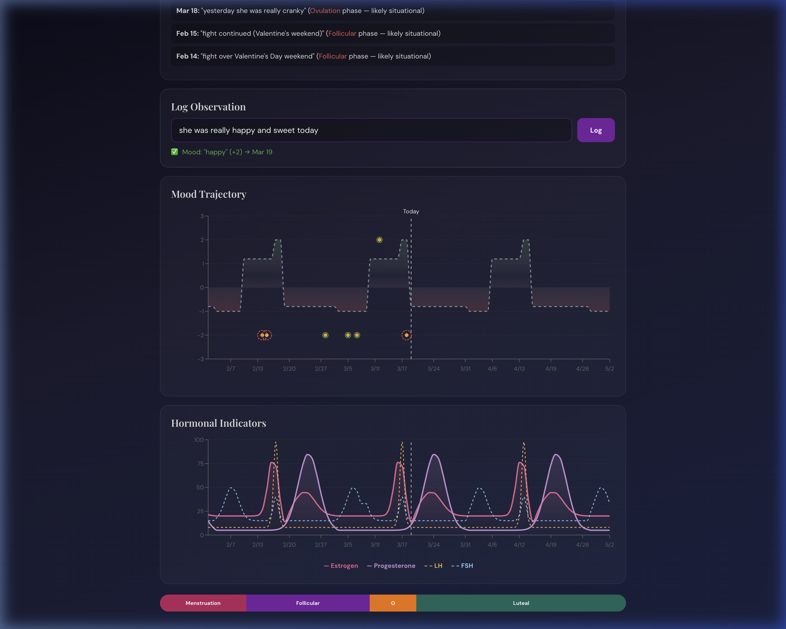
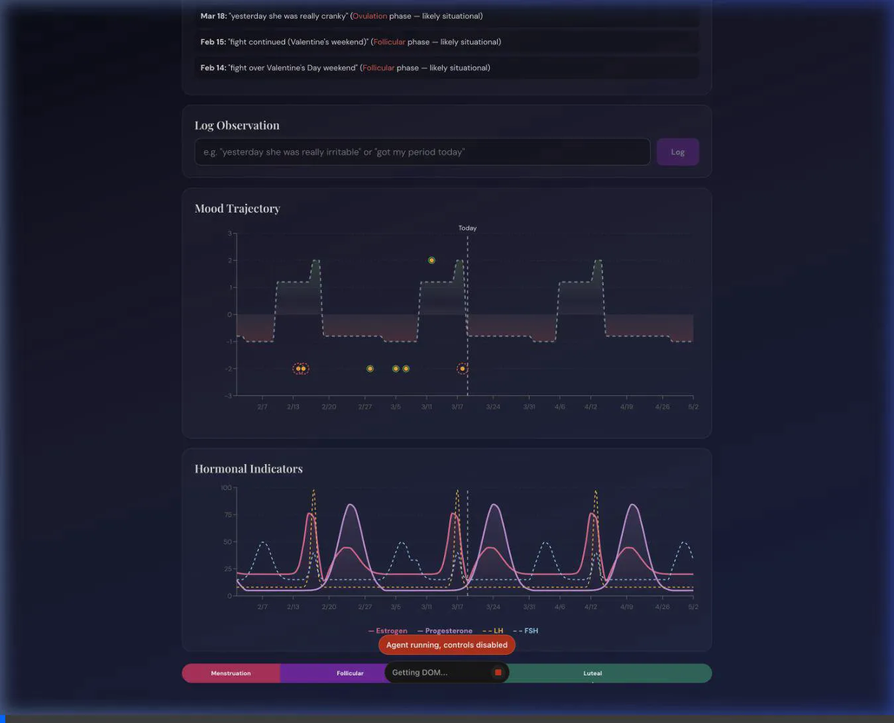

# Cycle Intelligence — Full Guide

Cycle Intelligence is a privacy-first, LLM-powered menstrual cycle tracker designed for partners and individuals to understand hormonal phases and their impact on mood and energy.

## 🚀 Getting Started

### Prerequisites
- **Python 3.8+**
- **Node.js 18+** (for running unit tests)
- **Gemini API Key** (for natural language parsing)

### Setup
1. **Clone the repository** (if you haven't already).
2. **Configure environment variables**:
   Create a `.env` file in the root directory:
   ```env
   GEMINI_API_KEY=your_api_key_here
   PORT=8000
   ```
3. **Install Python dependencies**:
   ```bash
   pip install -r requirements.txt
   ```

### Running the App
Start the backend server:
```bash
python3 server.py --port 18181
```
Open your browser to `http://localhost:18181`.

---

## 📱 How to Use

### Natural Language Logging
Simply type how the day went in the input box at the bottom. The app uses **Gemini 2.5 Flash** to extract mood scores and dates automatically.

- **"She was so happy today"** → Logs a `+2` for today.
- **"Yesterday she was a bit sensitive"** → Logs a `-1` for yesterday.
- **"Monday was a total meltdown"** → Logs a `-3` for last Monday.



### Tracking Period Dates
To update the cycle model, just tell the app when the period started:
- **"Period started today"**
- **"Her period arrived on March 5"**

### Understanding the Dashboard
- **Hormone Trajectory**: Visualizes Estrogen, Progesterone, LH, and FSH levels.
- **Mood Overlay**: Your logged moods are plotted against the "Hormonal Average" (dotted line).
- **Model Confidence**: Shows how well the logged moods align with the hormonal model.
- **Upcoming Windows**: Highlights "Sensitive" (Luteal/Menstruation) and "Resilient" (Follicular/Ovulation) periods.

### History & Editing
- **Undo**: Type "undo" to remove the most recent entry.
- **Edit/Delete**: Switch to the **History** tab to edit entries inline or delete them.


---

## 🛠 Developer Guide

### Project Structure
- `server.py`: Python HTTP server and API endpoints.
- `db.py`: SQLite database layer.
- `app.js`: React UI components and state management.
- `logic.js`: Isolated core logic (hormone math, parsing) shared with tests.
- `index.html`: Main entry point.

### Logic Isolation
All core calculations are isolated in `logic.js`. This file is loaded by the browser and can also be `require`'d by Node.js for testing.

### Running Unit Tests
We maintain 100% coverage on core logic for reliability.

**Backend Tests (Python):**
```bash
python3 -m unittest tests/test_db.py
```

**Frontend Tests (Node.js):**
```bash
node --test tests/test_logic.js
```

---

## 🧪 Verification & Stability
The project includes automated verification steps and a robust logging system. Any changes to the model or database are verified against the existing test suite.




