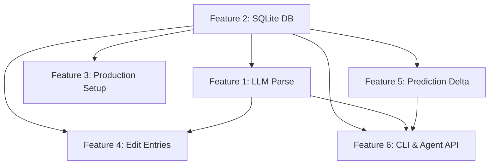

# Cycle Intelligence — Implementation Plan

> Detailed technical plan for all features. Designed for multi-agent parallel execution.
> Each section is self-contained and can be handed off independently.

---

## Current Architecture

```
cycle_tracker/
├── index.html          # Single HTML page, inline CSS, loads React + Recharts via CDN
├── app.js              # 677 lines, pure React.createElement (no JSX, no build step)
├── server.py           # Python http.server, serves static files + JSON API
├── data/
│   ├── mood_log.md     # Markdown table: | Date | Score | Event |
│   └── period_log.md   # Markdown table: | Date |
├── cycle-intelligence-spec.md
├── initial_data.md
└── backlog.md
```

**API endpoints (current):**
- `GET  /api/data` → full state JSON
- `POST /api/mood` → `{ date, score, label }` → appends to mood_log.md
- `POST /api/period` → `{ date }` → appends to period_log.md
- `POST /api/period/delete` → `{ date }` → removes from period_log.md

**Data model (JSON served to frontend):**
```json
{
  "lastPeriodStart": "2026-03-04",
  "cycleLength": 27,
  "periodLength": 5,
  "moodEntries": [{ "date": "YYYY-MM-DD", "score": -3..+3, "label": "text" }],
  "periodDays": ["YYYY-MM-DD", ...]
}
```

---

## Feature 1 — LLM-Powered Log Capture

### Goal
Replace the brittle keyword-matching `parseInput()` in `app.js` with a server-side Gemini 2.5 Flash API call. Users type natural language; the LLM extracts structured data.

### API Model
- **Model:** `gemini-2.5-flash`
- **Temperature:** 0.1 (deterministic extraction)
- **API Key:** Read from `GEMINI_API_KEY` environment variable
- **Endpoint:** `https://generativelanguage.googleapis.com/v1beta/models/gemini-2.5-flash:generateContent`

### New Endpoint

#### `POST /api/parse`
**Request:** `{ "text": "yesterday she was really irritable and snappy" }`

**LLM System Prompt:**
```
You are a mood/event parser for a menstrual cycle tracking app. 
Extract structured data from the user's natural language input.

Return ONLY valid JSON with this schema:
{
  "entries": [{
    "date": "YYYY-MM-DD",
    "type": "mood" | "period",
    "score": -3 to +3 (integer, only for mood type),
    "summary": "brief event description",
    "original_text": "the part of input this was extracted from"
  }],
  "understood": true/false,
  "clarification": "optional message if input is ambiguous"
}

Mood scoring guide:
  -3: screaming, raging, explosive meltdown, terrible
  -2: angry, fighting, irritable, overreacting, hostile, bad mood
  -1: sensitive, emotional, withdrawn, tearful, quiet, off
   0: neutral
  +1: fine, okay, normal, stable, decent
  +2: happy, cheerful, calm, patient, loving, good mood, sweet
  +3: amazing, incredible, ecstatic, fantastic

Date resolution rules:
- "today" = {current_date}
- "yesterday" = {yesterday_date}
- Relative days: "3 days ago", "last Tuesday", etc.
- If no date mentioned, assume today.
- Support backdating without friction.

For period entries, detect phrases like "period started", "got her period", "day 1 of cycle".
```

**Response:** The parsed JSON from the LLM, wrapped in:
```json
{
  "parsed": { ... },          // LLM extracted entries
  "raw_text": "original input"
}
```

### Frontend Changes (`app.js`)

1. Replace `parseInput()` usage with async call to `/api/parse`
2. Add debounced preview: on input change, wait 500ms of idle, then call `/api/parse`
3. Show a small spinner during parse
4. Maintain local `parseInput()` as immediate fallback (runs synchronously for instant feedback)
5. When LLM result arrives, override the local preview
6. On "Log" click, use the LLM-parsed result if available, else fall back to local parse

### Example Inputs the LLM Should Handle

| Input | Expected Output |
|-------|----------------|
| `"yesterday she was really irritable"` | `{ date: yesterday, type: mood, score: -2, summary: "irritable" }` |
| `"today was x but actually pretty calm tbh"` | `{ date: today, type: mood, score: +2, summary: "calm mood" }` |
| `"got her period today"` | `{ date: today, type: period }` |
| `"Monday was bad, Tuesday was fine"` | Two entries: Mon score -2, Tue score +1 |
| `"she's been emotional all week"` | Single entry for today, score -1 |
| `"we had a fight on march 5"` | `{ date: 2026-03-05, type: mood, score: -2, summary: "fight" }` |
| `"period started 3 days ago"` | `{ date: 3_days_ago, type: period }` |

### Verification
- [ ] Type "yesterday she was cranky" → see parsed preview → log → appears in chart
- [ ] Type "Monday bad, Tuesday fine" → see two entries parsed → log both
- [ ] Disconnect API key → falls back to local parser without error
- [ ] Type gibberish → shows "Could not understand" message

---

## Feature 2 — SQLite Database

### Goal
Replace markdown-file storage with SQLite for reliability, queryability, and structured data. Keep markdown as an export format.

### Schema

```sql
CREATE TABLE mood_entries (
    id INTEGER PRIMARY KEY AUTOINCREMENT,
    date TEXT NOT NULL,              -- YYYY-MM-DD
    score INTEGER NOT NULL,          -- -3 to +3
    summary TEXT NOT NULL,           -- brief description
    original_text TEXT,              -- raw user input
    predicted_score REAL,            -- model prediction at time of logging (nullable)
    delta REAL,                      -- actual - predicted (nullable)
    created_at TEXT DEFAULT (datetime('now')),
    updated_at TEXT DEFAULT (datetime('now')),
    UNIQUE(date)                     -- one entry per day (updates overwrite)
);

CREATE TABLE period_entries (
    id INTEGER PRIMARY KEY AUTOINCREMENT,
    date TEXT NOT NULL UNIQUE,       -- YYYY-MM-DD
    created_at TEXT DEFAULT (datetime('now'))
);

CREATE TABLE cycle_config (
    key TEXT PRIMARY KEY,
    value TEXT NOT NULL
);
-- Stored keys: 'period_length' (default '5')
```

### New Module: `db.py`

```python
import sqlite3, os

DB_PATH = os.path.join(os.path.dirname(__file__), "data", "cycle.db")

def get_conn():
    conn = sqlite3.connect(DB_PATH)
    conn.row_factory = sqlite3.Row
    conn.execute("PRAGMA journal_mode=WAL")
    return conn

def init_db():
    """Create tables if not exist, run migration from markdown if db is empty."""

def upsert_mood(date, score, summary, original_text=None, predicted_score=None):
    """Insert or update mood entry for a given date."""

def delete_mood(date):
    """Remove mood entry."""

def get_moods(start_date=None, end_date=None):
    """Query mood entries, optionally filtered by date range."""

def upsert_period(date):
    """Add period start date."""

def delete_period(date):
    """Remove period start date."""

def get_periods():
    """Get all period dates sorted."""

def compute_cycle_length():
    """Calculate from period dates, same 21-40 day filter logic."""

def build_state():
    """Assemble the full state JSON for the frontend."""

def export_markdown():
    """Dump mood_entries and period_entries back to markdown files."""
```

### Migration Script

```python
def migrate_from_markdown():
    """Read existing mood_log.md and period_log.md, insert into SQLite.
    Only runs if database tables are empty."""
```

### Server Changes (`server.py`)
- Import `db` module
- Replace all `read_mood_log()`, `read_period_log()`, `append_mood()`, etc. with `db.*` calls
- Add `GET /api/export` → triggers markdown export and returns file paths

### Verification
- [ ] Start server with empty db → auto-migrates from existing markdown
- [ ] All existing API endpoints work identically
- [ ] New entries persist across server restarts
- [ ] `GET /api/export` produces valid markdown files

---

## Feature 3 — Production App Setup

### Goal
Make the app installable and runnable with minimal friction.

### Files to Create/Modify

#### `[NEW] requirements.txt`
```
google-genai>=1.0.0
```
(No other deps — stdlib http.server, sqlite3, json are all built-in)

#### `[NEW] .env.example`
```
GEMINI_API_KEY=your_api_key_here
PORT=8000
```

#### `[NEW] Makefile`
```makefile
.PHONY: setup run dev

setup:
	pip install -r requirements.txt
	cp -n .env.example .env || true

run:
	python3 server.py

dev:
	python3 server.py
```

#### `[MODIFY] server.py`
- Read `GEMINI_API_KEY` and `PORT` from environment / `.env` file
- Add proper error logging
- Add graceful shutdown handler

### Verification
- [ ] `make setup && make run` → server starts on configured port
- [ ] Missing API key → server starts but /api/parse returns helpful error

---

## Feature 4 — Edit Log Entries

### Goal
Let users edit and delete entries via natural language or a simple list UI.

### New Endpoints

#### `POST /api/entry/update`
```json
{
  "text": "update the entry on march 5 to say she was calm",
  "date": "2026-03-05"       // optional, LLM extracts if missing
}
```
Uses LLM to parse the edit intent, then calls `db.upsert_mood()`.

#### `POST /api/entry/delete`
```json
{ "date": "2026-03-05" }
```

### Frontend: Edit Mode in History Tab

**Current:** History tab shows read-only mood entries.

**New behavior:**
1. Each card gets a small edit (✏️) and delete (🗑) icon
2. Tapping edit turns the label into an editable one-liner text field
3. User types "she was calm" (not structured format)
4. On blur/enter: sends to `/api/parse` to re-extract score + summary
5. Result updates the entry via `/api/entry/update`
6. Tapping delete shows confirm → calls `/api/entry/delete`
7. Support natural language commands in the main input: "update march 5 to calm"

### Verification
- [ ] Edit an entry inline → score and label update in real-time
- [ ] Delete an entry → removed from log and chart
- [ ] Type "change march 5 to happy" in input → finds and updates entry
- [ ] "Undo last entry" → removes most recent entry

---

## Feature 5 — Prediction Feedback & Delta Tracking

### Goal
When a user logs actual mood for a predicted day, capture the prediction delta without disturbing the prediction line. This builds the feedback loop for model tuning.

### Data Flow

1. User logs mood for date X
2. Server looks up chart prediction for date X (run `calcHormones` + `phaseProfile` for that day)
3. Store: `predicted_score = phase_avg`, `delta = actual_score - predicted_score`
4. Frontend: prediction line stays as-is (dashed grey), actual dots appear on top

### Schema (already in Feature 2)
- `mood_entries.predicted_score` — the model's predicted mood at time of logging
- `mood_entries.delta` — actual - predicted

### Server Changes

In the mood logging endpoint:
```python
def log_mood_with_prediction(date, score, summary, ...):
    # Calculate what the model predicted for this date
    day_in_cycle = compute_day_in_cycle(date)
    phase = get_phase(day_in_cycle)
    predicted = PHASE_PROFILES[phase]['avg']
    delta = score - predicted
    db.upsert_mood(date, score, summary, predicted_score=predicted, delta=delta)
```

### Frontend: Delta Display

- **Mood Trajectory Chart:** Add a subtle shaded region between the prediction line and actual dots where data exists
- **Model Confidence Card:** Add aggregate delta stats:
  - "Avg prediction error: ±X.X"
  - "Model tends to overestimate by X during Luteal" (etc.)
- **History entries:** Show delta badge: "Predicted: +1.2, Actual: -2, Δ: -3.2"

### Retroactive Apply
- When existing entries don't have `predicted_score`, add a `/api/backfill-predictions` endpoint
- Runs the model for each historical entry's date and populates the predicted_score and delta

### Cycle Length Trending
- Store each computed `cycleLength` in `cycle_config` with a timestamp when period entries change
- Display a small sparkline or stat in the History tab: "Cycle length: 27d (stable)" or "27d → 29d (lengthening)"
- CLI: `cli.py status` includes `cycle_trend` field

### Verification
- [ ] Log mood on a future-predicted date → prediction captured, delta computed
- [ ] Prediction line on chart remains unchanged
- [ ] Model Confidence card shows delta statistics
- [ ] Backfill endpoint fills in historical predictions

---

## Feature 6 — CLI & Agent API

### Goal
A command-line tool that other agents (e.g. chatbot with tool-calls) can use to query and log data. Machine-readable JSON output by default, human-friendly text with `--pretty`.

### File: `[NEW] cli.py`

```
usage: cli.py [-h] [--json] {status,log,query,forecast,advisory,edit,export} ...

Cycle Intelligence CLI — query and manage cycle tracking data

subcommands:
  status      Current phase, risk level, patience/energy, tip
  log         Log a mood or period entry (natural language)
  query       Look up entries by date or date range
  forecast    Upcoming sensitive/resilient windows
  advisory    Natural-language sensitivity advisory for today
  edit        Update or delete an existing entry
  export      Export data as markdown

options:
  -h, --help  Show this help message
  --json      Output as machine-readable JSON (default: human-friendly)
  --pretty    Human-friendly formatted output (default if not --json)
```

### Subcommand Details

#### `cli.py status`
```json
{
  "date": "2026-03-19",
  "day_in_cycle": 15,
  "cycle_length": 27,
  "phase": "Luteal",
  "risk_level": "high",
  "patience": 30,
  "energy": 35,
  "estrogen": 14,
  "progesterone": 11,
  "tip": "Tread carefully, save confrontations",
  "advisory": "⚠️ High sensitivity period. Avoid difficult conversations and be extra patient."
}
```

**Human-friendly output:**
```
╔══════════════════════════════════════╗
║  Day 15 of 27 — Luteal Phase        ║
║  Risk Level: ██████████░░ HIGH       ║
╠══════════════════════════════════════╣
║  Patience:  30%  ████░░░░░░         ║
║  Energy:    35%  █████░░░░░         ║
║  Estrogen:  14%  ██░░░░░░░░         ║
║  Progesterone: 11%  █░░░░░░░░       ║
╠══════════════════════════════════════╣
║  ⚠️  High sensitivity period.       ║
║     Avoid difficult conversations.  ║
╚══════════════════════════════════════╝
```

#### `cli.py log "yesterday she was upset"`
- Calls `/api/parse` then `/api/mood` (or calls LLM + db directly)
- Returns confirmation with parsed result

#### `cli.py query --date 2026-03-05`
- Returns entry for that date
- Supports `--from` / `--to` for ranges
- Supports `--phase Luteal` to filter by phase

#### `cli.py forecast --days 14`
```json
{
  "windows": [
    { "type": "Sensitive", "start": "2026-03-20", "end": "2026-03-31", "phase": "Luteal", "risk": "high" },
    { "type": "Sensitive", "start": "2026-04-01", "end": "2026-04-05", "phase": "Menstruation", "risk": "high" },
    { "type": "Resilient", "start": "2026-04-06", "end": "2026-04-12", "phase": "Follicular", "risk": "low" }
  ]
}
```

#### `cli.py advisory`
Natural language output for chatbot consumption:
```
⚠️ SENSITIVITY ADVISORY — March 19, 2026

Current Phase: Luteal (Day 15 of 27)
Risk Level: HIGH

Today is within a high-sensitivity window (Mar 20 – Mar 31).
Patience and energy levels are both low.

Recommendations:
• Avoid bringing up financial topics or planning discussions
• Keep conversations light and supportive
• If tension arises, disengage gently — it's likely hormonal
• The next resilient window opens Apr 6 (Follicular phase)
```

#### `cli.py edit --date 2026-03-05 "she was actually calm"`
- Parses new description, updates entry

#### `cli.py export --format markdown`
- Dumps to `data/mood_log.md` and `data/period_log.md`

### Tool Schemas for LLM Function-Calling

Create `tool_schemas.json` at project root:
```json
{
  "tools": [
    {
      "name": "cycle_status",
      "description": "Get current cycle phase, risk level, and advisory",
      "parameters": {}
    },
    {
      "name": "cycle_log",
      "description": "Log a mood observation or period event",
      "parameters": {
        "text": { "type": "string", "description": "Natural language description" }
      }
    },
    {
      "name": "cycle_query",
      "description": "Look up mood entries by date or date range",
      "parameters": {
        "date": { "type": "string", "description": "YYYY-MM-DD" },
        "from": { "type": "string", "description": "Start date" },
        "to": { "type": "string", "description": "End date" }
      }
    },
    {
      "name": "cycle_forecast",
      "description": "Get upcoming sensitive/resilient conversation windows",
      "parameters": {
        "days": { "type": "integer", "description": "Days to forecast", "default": 14 }
      }
    },
    {
      "name": "cycle_advisory",
      "description": "Get a natural language sensitivity advisory for today",
      "parameters": {}
    }
  ]
}
```

### Verification
- [ ] `python3 cli.py status` → correct phase and stats
- [ ] `python3 cli.py log "yesterday was bad"` → entry created
- [ ] `python3 cli.py query --date 2026-03-05` → returns entry
- [ ] `python3 cli.py forecast --days 14` → shows upcoming windows
- [ ] `python3 cli.py advisory` → readable advisory text
- [ ] `python3 cli.py --json status` → valid JSON output
- [ ] `python3 cli.py export` → generates markdown files

---

## Dependency Graph



**Recommended execution order for parallelism:**
1. **Wave 1 (parallel):** Feature 2 (DB) + Feature 3 (production setup)
2. **Wave 2 (parallel):** Feature 1 (LLM parse) + Feature 5 (prediction delta) — both depend on DB
3. **Wave 3 (parallel):** Feature 4 (edit entries) + Feature 6 (CLI) — depend on LLM parse + DB

---

## Files Changed Per Feature

| Feature | New Files | Modified Files |
|---------|-----------|---------------|
| 1 — LLM Parse | — | `server.py`, `app.js` |
| 2 — SQLite | `db.py`, `data/cycle.db` | `server.py` |
| 3 — Production | `requirements.txt`, `.env.example`, `Makefile` | `server.py` |
| 4 — Edit Entries | — | `server.py`, `app.js`, `db.py` |
| 5 — Delta Tracking | — | `server.py`, `app.js`, `db.py` |
| 6 — CLI | `cli.py`, `tool_schemas.json` | — |
